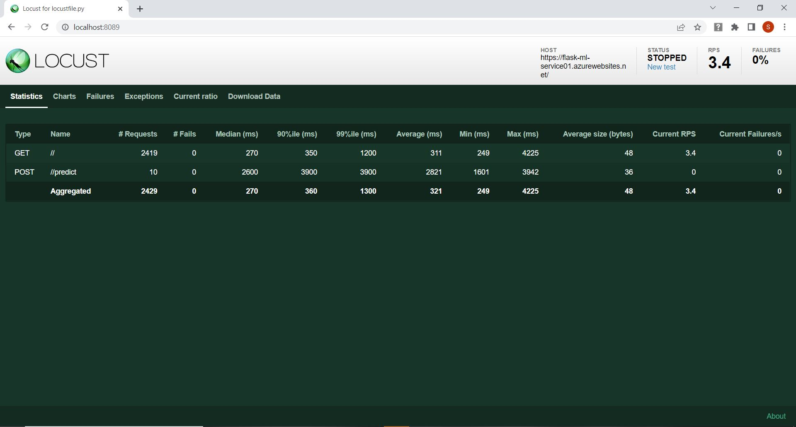

# Overview

The CI/CD Pipeline project is to demonstrate setting up Azure Pipelines and Github Actions to deploy a Flask starter code to Azure App Services. We make some changes in the starter code for library versions, create a python virtual env and a miniconda installer for specific python version. After running the Azure Web App service and testing the prediction, we commit the delta changes in Github and integrate the workflow with Azure Pipeline and Github Actions, so that subsequent changes in Github automatically triggers build and deployment.

## Project Plan

* A link to a Trello board for the project:
  - https://trello.com/b/1Z98Wkne/building-a-ci-cd-pipeline
* A link to a spreadsheet that includes the original and final project plan:
  - https://docs.google.com/spreadsheets/d/1nhY7yxAXK9w2wiocfXecUQAX61Cs7iz6yhkYX0LK82M/edit#gid=1348135932

## Instructions
 
* Architectural Diagram (Shows how key parts of the system work):

## Instructions for running the Python project - 

1. Create a new GitHub Repo without the README.md file

2. Download the Flask starter code from Azure-Cloud-DevOps-Starter-Code/C2-AgileDevelopmentwithAzure/project/starter_files/flask-sklearn/ and add the following files in the new repo: 
   - Dockerfile
   - Makefile
   - README.md
   - app.py
   - boston_housing_prediction.joblib
   - housing.csv
   - make_predict_azure_app.sh
   - make_prediction.sh
   - requirements.txt
   - run_docker.sh
   - run_kubernetes.sh
   - upload_docker.sh

3. Create ssh keys and add it to the GitHub repo:

	   - ssh-keygen -t rsa
	   - cat /home/sambuddha/.ssh/id_rsa.pub
	   - (copy Key)
	   - Goto Github->Settings->SSH and GPG Keys->New SSH Key-><Title> and <Key>-> Add SSH Key
 
4. Clone the Github repo in Cloud Shell:
	
	   - git clone git@github.com:sambuddha6/flask-sklearn.git
  
5. Create Virtual Env and activate and move to the project folder:
	
	
	   - python3 -m venv ~/.flask-sklearn
	   - source ~/.flask-sklearn/bin/activate
	   - cd flask-sklearn

6. Create a miniconda env for Java 3.6.5:
	
	
	   - python -V
	   - wget https://repo.continuum.io/miniconda/Miniconda3-4.5.4-Linux-x86_64.sh
	   - sh Miniconda3-4.5.4-Linux-x86_64.sh -u
	   - export PATH=~/miniconda3/bin:$PATH
	   - python -V
  
7. Update the requirements.txt:
   - Flask==2.0.3
   - pandas==1.1.5
   - scikit-learn==0.20.4
   - joblib
   - pylint
   - pytest
   - jsonschema
  
8. Make the following changes in Makefile:

    a) add under test:
    
		- test:
		- python -m pytest -vv test_app.py
    
    b) update under lint:
    
		- lint:
		- pylint --disable=R,C,W1203,W0702 app.py
  
9. Add the following changes in app.py:
	
    a) update line #17:
	   
	   	scaler = StandardScaler(with_mean=False).fit(payload)
	   
    b) add after line #58:
	   
	   	clf = clf[0][0]
  
10. Add the following changes in make_predict_azure_app.sh:

    a) update line #28:
   	
		-X POST https://flask-ml-service01.azurewebsites.net:$PORT/predict
  
11. Add a new test_app.py (refer to the Github repo)
  
12. Run the Makefile:

		- make all
  
13. Start the service:
	
		- az webapp up -n flask-ml-service01
	
		- Post-Deployment check https://flask-ml-service01.azurewebsites.net/
  
14. Run prediction:
    
    	- chmod 744 make_predict_azure_app.sh
    	- ./make_predict_azure_app.sh
  
15. Stream the logs:
    
    	- az webapp log tail
  
16a. Commit all changes:
	
	- git status
	- git add Makefile
	- git add requirements.txt
	- git add app.py
	- git add test_app.py
	- git commit -m "Changes made for successful run"
  
16b. Execute next 3 lines if Github throws error for email id and name:

	 - git config --global user.email "sambuddha6@gmail.com"
	 - git config --global user.name "Sambuddha"
	 - git commit -m "Changes made for successful run"

16c. Push the changes:

         - git push
  
17. - Goto dev.azure.com 
    - Creare new Organization and new Project if not there
    - Create new Pipeline
    - Where is your code -> GitHub
    - Select a Repository -> sambuddha6->flaskml-test (Repository access-> Only select repositories -> Approve and Install)
    - Configure your pipeline -> Python to Linux Web App on Azure
    - Select an Azure subscription
    - Authorize
    - Web App Name -> flask-ml-service01
    - Validate and Configure
    - Review your pipeline YAML
    - Save and Run
    - Commit Message
    - Commit directly to the main branch
    - Save and Run
    - BuildStage -> BuildJob
    - Deploy Web App -> DeploymentJob
  
18. Check azure-pipelines.yml in GitHub repo
  
19. Edit app.py:

    a) update line #23 to update the text between the h3 tags and commit the changes
    
    b) monitor the trigger in deployment:
       
       - Post-Deployment check https://flask-ml-service01.azurewebsites.net/

  ## Screenshots
* Project running on Azure App Service:
  
  
* Project cloned into Azure Cloud Shell:
  

* Passing tests that are displayed after running the `make all` command from the `Makefile`:
  
  
  

* Output of a test run:
  

* Successful deploy of the project in Azure Pipelines: 
  

* Running Azure App Service from Azure Pipelines automatic deployment:
  

* Successful prediction from deployed flask app in Azure Cloud Shell:
  

* Output of streamed log files from deployed application:
  

* Gihub actions success:
  
	
* Locust run:
  

## Enhancements

The project can be improved in the future 
1) by making it up-to-date with the latest python, scikit-learn and pandas version (can be run end-to-end without having to adjust with specific older versions of all required libraries)
2) by deploying to a kubernetes cluster
3) by including integration tests as part of pipeline
4) by building an image of the app and push to an image registry(e.g acr) and then do a containerized deployment
5) by enhancing the web page to add more dynamic content and making prediction a part of the content

## Demo :

- https://www.youtube.com/watch?v=tMcAp0MbzkU

Indvidual videos step-wise

- https://youtu.be/-wTJ74fZ6Kw (bringing Web service up)
- https://youtu.be/zoOa1VrxfhA (prediction and logs)
- https://youtu.be/ch0sjuaY1d0 (pipeline deployment)
- https://youtu.be/GwG8hvevsic (pipeline prediction and re-deploy)
- https://youtu.be/GL11iez-1SY (github actions deployment)
- https://youtu.be/yG2TDnqvsxM (github actions deployment prediction)
