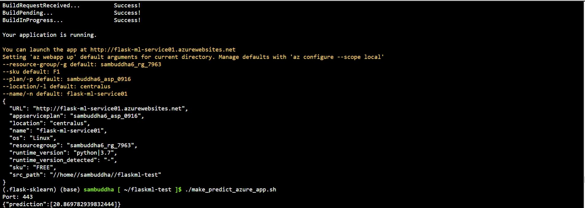

# Overview

The CI/CD Pipeline project is to demonstrate setting up Azure Pipelines to deploy the Flask starter code to Azure App Services  

## Project Plan

* A link to a Trello board for the project
  https://trello.com/b/1Z98Wkne/building-a-ci-cd-pipeline
* A link to a spreadsheet that includes the original and final project plan
  https://docs.google.com/spreadsheets/d/1nhY7yxAXK9w2wiocfXecUQAX61Cs7iz6yhkYX0LK82M/edit#gid=1348135932

## Instructions
 
* Architectural Diagram (Shows how key parts of the system work)


Instructions for running the Python project - 

1. Create a new GitHub Repo without the README.md file

2. Download the Flask starter code from Azure-Cloud-DevOps-Starter-Code/C2-AgileDevelopmentwithAzure/project/starter_files/flask-sklearn/ and add the following files in the new repo
   a) Dockerfile
   b) Makefile
   c) README.md
   d) app.py
   e) boston_housing_prediction.joblib
   f) housing.csv
   g) make_predict_azure_app.sh
   h) make_prediction.sh
   i) requirements.txt
   j) run_docker.sh
   k) run_kubernetes.sh
   l) upload_docker.sh

3. Create ssh keys and add it to the GitHub repo
   ssh-keygen -t rsa
   cat /home/sambuddha/.ssh/id_rsa.pub
   <copy Key>
   
   Goto Github->Settings->SSH and GPG Keys->New SSH Key-><Title> and <Key>-> Add SSH Key
 
4. Clone the Github repo in Cloud Shell
   git clone git@github.com:sambuddha6/flask-sklearn.git
  
5. Create Virtual Env and activate and move to the project folder
   python3 -m venv ~/.flask-sklearn
   source ~/.flask-sklearn/bin/activate
   cd flask-sklearn

6. Create a miniconda env for Java 3.6.5
   python -V
   wget https://repo.continuum.io/miniconda/Miniconda3-4.5.4-Linux-x86_64.sh
   sh Miniconda3-4.5.4-Linux-x86_64.sh -u
   export PATH=~/miniconda3/bin:$PATH
   python -V
  
7. Update the requirements.txt
   Flask==2.0.3
	 pandas==1.1.5
	 scikit-learn==0.20.4
	 joblib
	 pylint
	 pytest
	 jsonschema
  
8. Make the following changes in Makefile
    a) add under test:
	test:
		python -m pytest -vv test_app.py
    b) update under lint:
	lint:
		pylint --disable=R,C,W1203,W0702 app.py
  
9. Add the following changes in app.py
	a) update line #17
	   from
	   scaler = StandardScaler().fit(payload) 
	   to 
	   scaler = StandardScaler(with_mean=False).fit(payload)
	b) add after line #58
	   clf = clf[0][0]
  
10. Add the following changes in make_predict_azure_app.sh
   update line #28
   -X POST https://<yourappname>.azurewebsites.net:$PORT/predict
   to
   -X POST https://flask-ml-service01.azurewebsites.net:$PORT/predict
  
11. Add a new test_app.py and add the following
	
from app import app
import json
import jsonschema
from jsonschema import validate

predictSchema = {
    "type": "object",
    "properties": {
        "prediction": {"type": "number"}
    },
}

def test_validateJson():
    with app.test_client() as client:
        data = {"CHAS":{"0":0},
                "RM":{"0":6.575},
                "TAX":{"0":296.0},
                "PTRATIO":{"0":15.3},
                "B":{"0":396.9},
                "LSTAT":{"0":4.98}
                }

        response = client.post(
            "/predict",
            data=json.dumps(data),
            headers={"Content-Type": "application/json"},
        )

        try:
            validate(instance=data, schema=predictSchema)
        except jsonschema.exceptions.ValidationError as err:
            return False
        return True

def test_predict():
    with app.test_client() as client:
        inputdata = {"CHAS":{"0":0},
                "RM":{"0":6.575},
                "TAX":{"0":296.0},
                "PTRATIO":{"0":15.3},
                "B":{"0":396.9},
                "LSTAT":{"0":4.98}
                }

        response = client.post(
            "/predict",
            data=json.dumps(inputdata),
            headers={"Content-Type": "application/json"},
        )

        if response.data == { "prediction": [ 20.869782939832444 ] }:
            return True
        return False   
  
12. Run the Makefile
	make all
  
13. Start the service
	az webapp up -n flask-ml-service01
	
	Post-Deployment check https://flask-ml-service01.azurewebsites.net/
  
14. Run prediction
    chmod 744 make_predict_azure_app.sh
	./make_predict_azure_app.sh
  
15. Stream the logs
	az webapp log tail
  
16. Commit all changes
	git status
	git add Makefile
	git add requirements.txt
	git add app.py
	git add test_app.py

	git commit -m "Changes made for successful run"
  
  #Execute next 3 lines if Github throws error for email id and name
	git config --global user.email "sambuddha6@gmail.com"
	git config --global user.name "Sambuddha"
  git commit -m "Changes made for successful run"
	
  git push
  
17. Goto dev.azure.com 
    Creare new Organization and new Project if not there
    Create new Pipeline
    Where is your code -> GitHub
	  Select a Repository -> sambuddha6->flaskml-test (Repository access-> Only select repositories -> Approve and Install)
	  Configure your pipeline -> Python to Linux Web App on Azure
	  Select an Azure subscription
	  Authorize
	  Web App Name -> flask-ml-service01
	  Validate and Configure
	  Review your pipeline YAML
	  Save and Run
	  Commit Message
	  Commit directly to the main branch
	  Save and Run
	  BuildStage
		 -> BuildJob
	  Deploy Web App
		 -> DeploymentJob
  
18. Check azure-pipelines.yml in GitHub repo
  
19. Edit app.py 
		a) update line #23
	     from 
		   html = "<h3>Sklearn Prediction Home</h3>"
	     to
		   html = "<h3>Sklearn Prediction Home - Machine Learning</h3>"
	     and monitor the trigger in deployment
	
	   Post-Deployment check https://flask-ml-service01.azurewebsites.net/

  Screenshots
* Project running on Azure App Service
  
  
* Project cloned into Azure Cloud Shell
  

* Passing tests that are displayed after running the `make all` command from the `Makefile`
  
  
  

* Output of a test run
  

* Successful deploy of the project in Azure Pipelines.  [Note the official documentation should be referred to and double checked as you setup CI/CD](https://docs.microsoft.com/en-us/azure/devops/pipelines/ecosystems/python-webapp?view=azure-devops).
  

* Running Azure App Service from Azure Pipelines automatic deployment
  

* Successful prediction from deployed flask app in Azure Cloud Shell.  [Use this file as a template for the deployed prediction](https://github.com/udacity/nd082-Azure-Cloud-DevOps-Starter-Code/blob/master/C2-AgileDevelopmentwithAzure/project/starter_files/flask-sklearn/make_predict_azure_app.sh).
The output should look similar to this:
  

```bash
udacity@Azure:~$ ./make_predict_azure_app.sh
Port: 443
{"prediction":[20.35373177134412]}
```

* Output of streamed log files from deployed application
  

* Gihub actions success
  
	
* Locust run
  

## Enhancements

The project can be improved in the future by making it up-to-date with the latest python, scikit-learn and pandas version (can be run end-to-end without having to adjust with specific older versions of all required libraries)

## Demo 

<TODO: Add link Screencast on YouTube>


